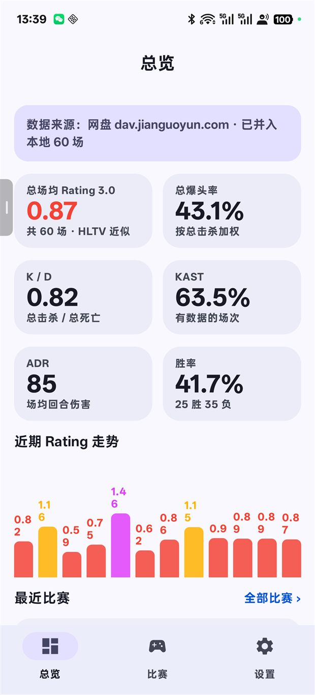
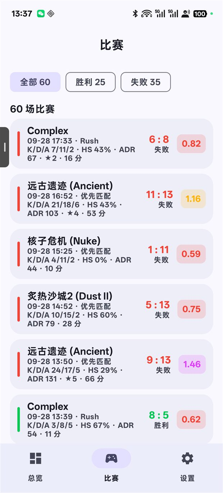
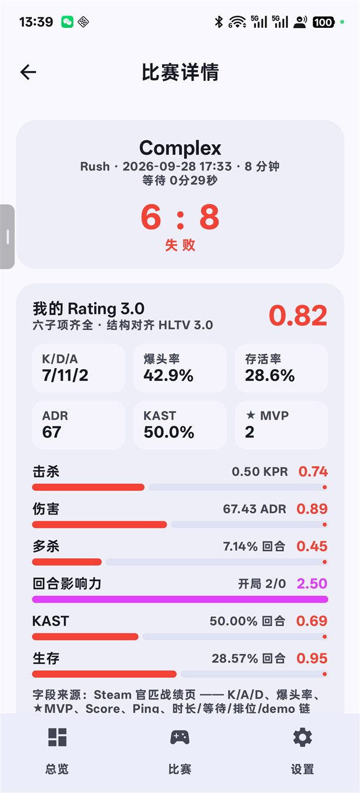
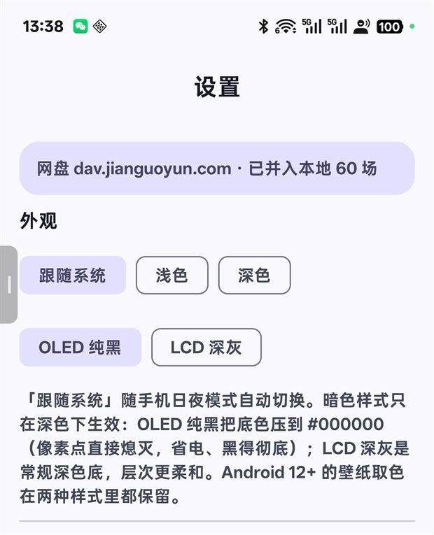
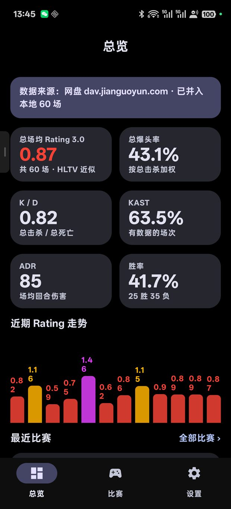

# CS2 战绩（Cs2Stats）

安卓端 CS2 比赛数据软件：Steam 账号 → 自建服务器归档 → 本地计算 **HLTV Rating 3.0 近似**，
Material Design 3 界面。

> 当前进度：**v0.6（`versionName = 0.6.0`）采集 + demo 解析 + 批量队列 + 归档闭环 + 暗色两档已跑通**（`assembleDebug` + `testDebugUnitTest` 43 个单测通过，
> APK ≈ 31.9 MB，其中原生解析库 `libcs2demo.so` 13.2 MB）。
> **仓库已按 GitHub 规范整理**：`.gitignore` 排除构建产物 / `local.properties` / 签名文件 / `backups/`，
> README 配图在 `docs/images/`，**源码与文档不含任何账号、密码、Cookie**（凭据只存手机 DataStore）。
> 真机实测：Steam OpenID 登录 → 抓官匹战绩 → 本地聚合 → 网盘归档 →
> **详情页手动「下载并解析本局 Demo」**，ADR / KAST / 多杀 / 开局杀 / 存活当场补齐，
> Rating 从「降级近似」变「六子项齐全」（同一场 1.11 → 1.16）。
> **批量解析队列（09-29 真机）**：比赛页一键把 8 场排队（最早先来、场间限速 3 秒）→
> 跑完 7 场 → 第 8 场下载中取消：服务停、`.part` 清零、卡片复位、汇总「成功 7 场、失败 0 场，
> 还有 1 场没跑」→ 重启跑完最后 1 场：「成功 1 场、失败 0 场」，**0 场待解析时按钮按预期消失**。
> **抓取不会冲掉解析成果**（`DemoStatsMerger.carryDemoFields`）：重新抓取时页面列以新抓的为准，
> demo 补的 6 列 + `demoParsedAt` 从本地搬回 —— 否则一次抓取就要重下 142 MB。
> **坚果云闭环已验证**：解析完成后自动 `PUT matches.json`（通知回执「已上传：60 场比赛 → dav.jianguoyun.com」），
> 「下载同步」读回后总览标签变「网盘 dav.jianguoyun.com · 已并入本地 60 场」，补齐字段不丢。
> 数据空间未配置时才回退示例数据；一旦采集到真实比赛，**示例数据被整体丢弃**（不会与真实战绩混算）。
> **库存页已按需求移除**（2026-09-29）：比赛软件暂时用不上饰品库存，底部只剩 总览 / 比赛 / 设置；
> 代码与旧文档整份备份在 `backups/20260929-remove-inventory/`（含 `RESTORE.md` 恢复步骤，**本地目录、不随仓库上传**），
> 后期决定再上这个功能时按备份原样恢复即可。App 从没采集过库存，移除**没有丢任何真实数据**。
> **暗色模式两档（09-29 真机像素级实测）**：设置页顶部「外观」——主题三档（跟随系统 / 浅色 / 深色），
> 深色再分 **OLED 纯黑**（底色 `#000000`）与 **LCD 深灰**（壁纸取色底 `#10131C`）两种底；
> 系统日夜状态一变就跟着换肤，状态栏/导航栏图标明暗**按应用**而非按系统，四种组合全部实测通过。

---

## 界面一览

| 总览 | 比赛列表 | 比赛详情 |
| :---: | :---: | :---: |
|  |  |  |

| 设置（外观：主题三档 + 暗色两档） | 暗色总览（OLED 纯黑 `#000000`） |
| :---: | :---: |
|  |  |

> 截图取自真机 PKR110（1264×2780）；设置页截图已裁掉数据空间账号区（仓库不含任何凭据）。

---

## 功能（按需求对照）

| 需求 | 状态 | 说明 |
| --- | --- | --- |
| 登录 Steam 获取账号 | ✅ | 应用内 WebView 走 Steam OpenID，拦截 `openid.claimed_id` 自动回填 SteamID64，并拉取昵称/头像（需资料公开） |
| 采集官匹比赛 | ✅ | 设置页一键抓取社区 `gcpd/730`（5 个页签 + `ajax=1` 分页），逐页诊断落盘、失败可跳过 |
| 每场比赛评分 / 战绩 | ✅ | 详情页：比分、K/D/A、HS%、★MVP、Score、Ping、存活率、排位/等待/时长、Rating 拆解、双方战绩表 |
| Rating 3.0 分数 | ✅ | 本地计算；官匹可得 **Kills + Survival**（生存按恒等式反推），其余 4 子项缺席即自动剔除权重重归一化并标注降级 |
| 补齐评分字段 | ✅ | 详情页按需「**下载并解析本局 Demo**」：demoinfocs-golang 原生库本机解析，只补空缺、不覆盖战绩页，配了网盘自动归档；比赛页另有**批量队列**（最早先来、限速、可取消、单场失败不中断） |
| 库存查看 | ⏸️ **已移除** | 2026-09-29 按需求整体下线（比赛软件暂不需要）：整页、底部标签、`InventoryItem`、云盘 `inventory.json` 读写一并摘除，**代码与旧文档备份在 `backups/20260929-remove-inventory/`（本地目录，不入库）**，后期可原样恢复 |
| 总场均 Rating / 爆头率 | ✅ | 总览页：总场均 Rating、总爆头率（按总击杀加权）、K/D、KAST、ADR、胜率、近期走势 |
| 数据上传 / 云空间数据库 | ✅ | **可插拔存储层**：默认 WebDAV 网盘（坚果云），JSON 文件即数据库，支持测试连接 / 下载同步 / 上传；本地采集缓存 `files/local_matches.json` 兜底 |
| 设置里预留第三方接口 | ✅ | FACEIT API Key 字段已预留，暂不参与拉取 |
| Material Design 3 | ✅ | M3 色彩/字体/组件，Android 12+ 动态取色；**暗色两档**：主题跟随系统/浅色/深色三选，深色底可选 OLED 纯黑 与 LCD 深灰 |

---

## 外观：暗色两档（OLED 纯黑 / LCD 深灰）

设置页顶部「外观」两行芯片，点完立刻生效（`AppSettings` 落 DataStore，重启不丢）。

**主题三档**（第一行）：

| 档位 | 行为 |
| --- | --- |
| **跟随系统**（默认） | 随手机日夜模式自动切换（Compose `isSystemInDarkTheme()` 驱动） |
| 浅色 | 定死浅色，系统深夜也浅 |
| 深色 | 定死深色，系统白天也深 |

**深色两种底**（第二行，只在深色时生效）：

| 样式 | 底色 | 适用 |
| --- | --- | --- |
| **OLED 纯黑**（默认） | 画布 `#000000`，容器 `#080808`~`#1C1C1C` 留一丝灰 | OLED 屏：像素点直接熄灭，省电、黑得彻底 |
| LCD 深灰 | 跟随底色：Android 12+ 用壁纸取色（本机实测 `#10131C`），否则品牌深灰 `#0F1419` | 层次更柔和，不做纯黑 |

实现要点（`ui/theme/Theme.kt` 的 `ColorScheme.asOledDark()`）：

- **只压中性色**：`background / surface / surfaceDim / surfaceContainer*` → 近黑；主色、主容器、强调橙一律不动，
  所以 Android 12+ 的壁纸取色在两种样式里都还在，只是底不同；
- **`surfaceVariant` 不压**：它是比赛行背景与进度条轨道（`alpha=0.45` 叠在底色上），压黑了在纯黑上就看不见；
- **状态栏/导航栏图标明暗按应用走**（`SideEffect` 里改 `WindowCompat` 的 `isAppearanceLight*Bars`）：
  系统白天却强制深色时图标要变白，否则深底配深图标看不见 —— 这一格真机验证过；
- **兜底**：DataStore 里存了不认识的取值 → 回落「跟随系统 + OLED 纯黑」，不会把界面染成没配过的颜色；
- **10 条单测**（`ThemeModeTest.kt`）锁死：三档 × 两态切换矩阵、OLED 画布必须是 `#000000`、
  主色与 `surfaceVariant` 不许被动、幂等。

真机实测（PKR110，1264×2780，**截图像素采样**，不是目测）：

| 场景 | 页面底色 | 状态栏时钟像素 |
| --- | --- | --- |
| 系统夜间 + 跟随系统 + OLED | `#000000` | `#FFFFFF`（白） |
| 系统夜间 + 跟随系统 + LCD | `#10131C` | 白 |
| 系统夜间 + 强制浅色 | `#FAF8FF` | `#191819`（深） |
| 系统白天 + 强制深色 + OLED | `#000000` | `#CCCCCC`（白） |
| 杀进程重启 | 仍是「跟随系统 + OLED」（持久化 ✓） | — |

---

## 启动图标：准星断环 + 递增柱状图

自适应图标（minSdk 26 全走 `mipmap-anydpi-v26`，没有 PNG），两个图层：

| 图层 | 文件 | 内容 |
| --- | --- | --- |
| 背景 | `drawable/ic_launcher_background.xml` | 品牌藏蓝斜向渐变 `#1C3A66` → `#0A111D`（`angle=315`） |
| 前景 | `drawable/ic_launcher_foreground.xml` | 橙色**准星断环** + 三根**递增柱** |

- **寓意**：准星 = CS，柱子 = 战绩与评分走势，一个图标把「CS2 战绩」两半说全；
- **几何**（108×108 画布）：断环半径 33、描边 5、圆头，四段 66° 弧、四边各留 24° 缺口；
  柱子高 17 / 27 / 37、底对齐 `y=72`、描边 9 圆头（圆头直接当圆角柱）；
- **配色沿用应用内**：断环 `#FF6A3D`（强调橙）、柱子 `#DCE6FF`（primaryContainer 浅蓝白）；
- **安全区**：内容最外沿 35.5 < 36（72dp 安全区半径），圆形/方形/水滴形遮罩都裁不到；
- **缺口开在上下左右四个正方向**，中间那根柱子正上方正好是缺口 —— 柱子不会和准星竖臂连成一条线；
- 旧图标（白准星 + 外圈）的外圈圆心写成了 `(54,36)`，偏上 18dp 没居中，这次重画一并修掉；
- 真机验证：App 信息页与桌面（ColorOS 圆角遮罩）均正常渲染。

---

## 数据流

```
Steam 社区 gcpd/730 ──登录态抓取──▶ 手机客户端 ──本地采集缓存──▶ files/local_matches.json
                                          │                              │
                                          │   配了网盘就 ──上传归档──▶   │
                                          │                              ▼
                                          │                    网盘（WebDAV）里的 JSON 文件
                                          └────────── 下载同步 ◀──────────┘
                                          │
                                          └──本地计算 Rating 3.0（评分不上传，口径统一在端上）
```

为什么需要外部数据空间：**Valve 不提供 CS2 比赛历史 API**（Steam Web API 只有资料、库存、时长），
单场 K/D、伤害、KAST 等只有社区页面或第三方平台有，且社区页字段粗糙、易失效。
按既定方案：手机侧负责采集归档，**网盘当数据库**，端上统一算 Rating——不装服务器也能跑。

**本地优先**：采集结果先写 `files/local_matches.json`，重启/断网/没配网盘都能看到；
`load()` 时按比赛主键把「本地缓存 ∪ 网盘」去重合并。只有两边都空才回退示例数据，
且示例数据被标记为 `isSample`——采集到真实数据时**整体替换**，绝不混算。

---

## 数据空间：可插拔存储层

`data/store/SyncStore.kt` 把「数据空间」抽象成读写 JSON 文件：

| 文件 | 内容 |
| --- | --- |
| `profile.json` | 当前 Steam 资料 |
| `matches.json` | `{ "matches": [ <match>, ... ] }` |

> 曾经还有第三个 `inventory.json`（库存）。2026-09-29 库存功能整体移除后**不再读写**；
> 网盘上若还留着旧文件，忽略即可（App 从未采集过库存，里面是 0 件物品）。

实现：

- **`WebDavStore`（当前默认）**——坚果云 / Nextcloud / 群晖等通用 WebDAV：
  1. 坚果云网页版 → 设置 → 安全选项 → **第三方应用管理** → 添加应用 → 得到「应用密码」；
  2. 设置页填 地址 `https://dav.jianguoyun.com/dav/` + 登录邮箱 + 应用密码；
  3. Basic 认证，`GET` 读 / `PUT` 写 / `MKCOL` 自动补父目录 / `PROPFIND` 自测连通（401 = 密码错）；
- **`ApiClient`（保留备用）**——自建 HTTP 后端，接口契约见下节；
- 想换 GitHub 仓库当存储，加一个 `GitStore` 读写 raw 文件即可，界面不用动。

设置页三个模式：**示例数据 / 网盘同步 / 自建服务器**，随时切换。

---

## 比赛采集协议（2026-09-28 真机实测）

`data/collect/SteamMatchCollector.kt` + `GcpdParser.kt`。数据源是**登录态**的 Steam 社区
「我的游戏数据」页 `steamcommunity.com/profiles/<id>/gcpd/730/`：

### 用哪些页签

| 页签 | 结论 |
| --- | --- |
| `matchhistorypremier` | ✅ 有记分板（真机 57 场） |
| `matchhistoryrush` | ✅ 有记分板（**3v3，6 行**） |
| `matchhistoryscrimmage` | ✅ 有记分板（1 场） |
| `matchhistorycompetitive` / `matchhistorywingman` | ✅ 页面正常，但本人无记录（0 场） |
| `matchhistory` | ❌ 实为账号活动日志，不是比赛列表 |
| `matchhistorycasual` | ❌ 只有时间/模式清单，没有记分板 |
| `deepplayerstatsmatchentry` / `deepplayerstatsmatchevent` | ❌ Match Stats / Match Events 页签 ajax 返回 `html` 为空——**Valve 不提供逐回合数据** |
| `matchhistoryophydra` 等 | ❌ 遗留页签（Operation Hydra / 排行榜 / 举报等），与比赛无关 |

### 页面给了什么、反推什么、什么都没有

| 类别 | 字段 |
| --- | --- |
| **页面直接给** | 地图、模式、开赛时间(GMT)、时长、双方比分、10 人 `Ping K A D ★MVP HSP% Score`、`Ranked: Yes/No`、`Wait Time`、demo 直链 |
| **端上恒等反推** | 存活回合 = 回合数 − 阵亡数（CS 规则每回合最多阵亡一次，故是恒等式不是估算），UI 标 `≈` |
| **页面确实没有** | 伤害/ADR、KAST、多杀回合、开局杀、回合经济 → 对应 Rating 子项缺席，剔除权重重归一化。补齐只能靠 demo 解析或第三方（设置页已预留 FACEIT API） |

- **胜负读法**：比分未按胜负排序，比分行夹在两组球员行之间 → `比分 = 第0组 : 第1组`，
  我所在的组的回合数即 `myScore`（方向由用户对 Nuke 1:11 的回忆校准确认）。
- **记分板列序会变**：★ 列可能整列省略、也可能写成 `&nbsp;`，Ping 列也可能为空，
  所以解析用「第一个非整数格」定 K/A/D 边界，不写死下标。
- **demo 链接只保留约 30 天**（实测 65 场里 16 场有链接，样本跨 6/19~9/28）；
  过期比赛主键退化为 `gcpd-<epoch>-<地图>`。
- **分页与续期**：`ajax=1` 取 JSON 分页（`continue_token`），每请求延时 250 ms、连续 3 空页停、
  单页签上限 16 页；`jwt/refresh` 续期会话；手动跟 302；**逐页诊断落盘**到 `files/collector/`
  （`gcpd_<tab>_full.html` / `_p<N>.json`，失败路径也存），便于结构变更时定位。
- 登录态由 WebView `CookieManager` 与 OkHttp 共享，退出登录一并清除。

---

## 自建后端接口约定（备用方案）

`ApiClient.kt` 按以下契约对接，改后端只需对齐 JSON：

```
GET  {base}/api/v1/profile              -> { steamId, personaName, avatarUrl, profileUrl }
GET  {base}/api/v1/matches?limit=100    -> { "matches": [ <match> ] }
GET  {base}/api/v1/matches/{id}         -> <match>
POST {base}/api/v1/matches              -> 写入一场比赛（手机检测到新比赛后上传）

<match> = {
  "id": "...", "map": "mirage", "mode": "competitive",
  "startedAt": 1758000000, "durationSec": 2400,
  "myTeam": "TEAM_A", "myScore": 13, "enemyScore": 9,
  "hasRoundEconomy": false,
  "ranked": true, "waitTimeSec": 75,            // 可选：页面有 Ranked / Wait Time 行才给
  "replayUrl": "http://replay403.valve.net/730/<id>.dem.bz2",   // 可选：约 30 天过期
  "players": [ { "steamId": "...", "name": "...", "team": "TEAM_A",
                 "rounds": 22, "kills": 18, "deaths": 14, "assists": 4,
                 "hsKills": 9, "damage": 1720,
                 "kastRounds": 16, "survivedRounds": 7,
                 "multiKillRounds": 4, "openingKills": 3, "openingDeaths": 2,
                 "ping": 59, "mvps": 3, "score": 53 } ]   // 可选：记分板三列
}
```

- 可选字段缺失时评分自动降级，**不会崩溃**；
- 认证：`Authorization: Bearer <token>`（设置页可填）；
- 后端地址留空或「使用内置示例数据」开关打开时，App 完全离线跑示例数据。

---

## Rating 3.0 计算口径（`data/rating/Rating3.kt`）

核对 HLTV 官方文章《Introducing Rating 3.0》《Rating 3.0 adjustments go live》后实现：

- **六个子评分**：击杀 Kills、伤害 Damage、生存 Survival、KAST、多杀 Multi-Kills、回合影响力 Round Swing；
- **产出 60% / 代价 40%**：产出 = Kills + Damage + Multi-Kills，代价 = KAST + Survival，
  Round Swing 兼具两侧性质，各占一半；
- 子评分 = 实测值 ÷ 职业赛场基准值（KPR 0.68 / ADR 76 / KAST 72% / 生存 30% / 多杀 16% / 开局净胜 0.030），
  使**平均水平 ≈ 1.00**，与 HLTV「赛事均值 1.00」的口径对齐；
- 侧内先归一化，再按 60/40 合成；缺失子项剔除权重后重新归一化（详情页会标注「降级近似」）；
- **官匹降级后的实际形态**：可得子项是 **Kills + Survive**，
  生存不靠估算——`存活回合 = 回合数 − 阵亡数`（每回合最多阵亡一次，恒等式，
  `PlayerLine.survivedRoundsEff`，UI 用 `≈` 标注反推），因此**产出 60 / 代价 40 的结构仍然成立**，
  不会退化成单看击杀；伤害、KAST、多杀、Round Swing 四项确实无源可取，只能缺席；
- **Round Swing 近似**：HLTV 真实实现依赖逐回合经济快照与胜率变化（eco 修正），Steam 官匹拿不到，
  当前用「开局杀净胜 / 回合」近似（官匹连开局杀也没有 → 该子项同样缺席）；
  后端补上 `hasRoundEconomy` 与回合数据后，只需替换 `swing()`。
- HLTV **未公开精确系数**，本实现为结构一致的自定标定近似，不等同官方值。

---

## Demo 解析：本机补齐 ADR / KAST / 多杀 / 开局杀

页面拿不到的字段（伤害、KAST、多杀、开局杀、真实存活）只有回放里有。**按需手动触发**，
不在采集时逐局解析 —— 单场回放最大 142 MB、本机要跑十几秒，逐局会把流量和电耗打满。
回放链接约 **30 天过期**，过期那场就只能靠设置页预留的 FACEIT 接口。

### 链路

```
详情页按钮 ─▶ AppViewModel.startDemoParse ─▶ DemoParseService（前台服务）
      ─▶ 下载 .dem.bz2 ─▶ JNI libcs2demo.so（demoinfocs-golang）─▶ 结果 JSON
      ─▶ DemoStatsMerger 合并 ─▶ 写 files/local_matches.json ─▶ 配了网盘就归档
```

| 环节 | 实现 |
| --- | --- |
| 解析引擎 | `markus-wa/demoinfocs-golang v5.2.0`，`-buildmode=c-shared` 交叉编译成 arm64 `.so`（无 CMake、无第三方 SDK），`app/src/main/jniLibs/arm64-v8a/libcs2demo.so` |
| JNI | `tools/demoparse/cmd/jni` 导出 `parseJson / progress / cancel`，Kotlin 侧 `DemoNative` 走 `System.loadLibrary` |
| 下载 | OkHttp 流式写 `.part`，完成改名；上次失败/取消留下的完整 demo 直接复用，不重复拉流量 |
| 进度 | 下载 0–80% → 解析 80–95% → 合并归档 95–100%；400 ms 或 0.5% 节流 |
| 生命周期 | `dataSync` 类型前台服务 + 低优先级通知，`PARTIAL_WAKE_LOCK` 上限 15 分钟，`START_NOT_STICKY`；可退出页面 / 锁屏继续跑 |
| 取消 | 卡片与通知都可取消：下载断流、解析调 `DemoNative.cancel()`，半截 `.part` 当场删除 |
| 缓存 | `.dem.bz2` 解析成功即删（失败保留供复用），同目录最多 3 份，`trimCache()` 顺带清孤儿 `.part` |

> ⚠️ Android 12+ 对 `startForegroundService()` 有 5 秒强校验：服务必须在**任何分支 return 之前**
> 先调 `startForeground()`，否则系统抛 `ForegroundServiceDidNotStartInTimeException` 把整个 App 崩掉。
> 真机踩过一次（详见 `DemoParseService.onStartCommand` 的注释），代码已把「占前台」提到最前面，
> 且只用服务自身的 `jobRunning` 判断是否在跑——**不能读 `DemoParseBus`**，因为调用方会先发布占位进度。

### 批量队列（比赛页 `BatchParseCard`）

```
比赛页「批量解析 N 场 demo」─▶ 二次确认框（场次 + 流量估计 + 当前网络类型）
      ─▶ AppViewModel.startDemoQueue ─▶ DemoParseService(ACTION_START_QUEUE)
      ─▶ buildQueue()：本地 ∪ 网盘 → DemoQueue.candidates()
      ─▶ 逐场 runOne()（下载→解析→合并→归档，每场之间限速 3 秒）
      ─▶ 结束发汇总通知，queueActive 落回 false
```

| 规则 | 说明 |
| --- | --- |
| 谁进队列 | `replayUrl` 还在、且 `demoParsedAt == null`；示例数据整体跳过（`DemoQueue`，4 项单测锁死） |
| 顺序 | **按开始时间从早到晚**：越早的比赛越接近 30 天过期，先救它们 |
| 限速 | 场与场固定隔 3 秒；单场失败多停 1.5 秒让人看清原因，**失败不中断整队** |
| 流量确认 | 确认框写明场次与「每场约 70~150 MB」，并读出当前网络类型；**非 Wi-Fi 只提示不拦截**（确认框里已经念过流量，替用户按「禁止」会把没 Wi-Fi 的场景锁死） |
| 取消 | 卡片「取消队列」→ 正在跑的那场立刻断流 / 中止解析 → 汇总「成功 X 场、失败 Y 场，还有 Z 场没跑」 |
| 进度 | 通知与卡片文案都带「第 i/N 场 · 」前缀（`DemoParseService.qmsg()` 统一加）；`DemoParseState.queueActive` 只在**最后一条**状态落回 false，页面据此切换「进行中 / 按钮」 |
| 入口可见性 | 示例数据或 0 场待解析时**整块不渲染**（不摆点了没反应的按钮），下次采集到新比赛自动回来 |
| 与单场入口的关系 | 两条入口共用同一个服务与 `jobRunning` 闸门，谁先抢到谁跑，另一条被静默忽略 |

> 真机实测（09-29）：8 场排队 → 依次跑完 7 场（127/95/159…MB，通知逐场推进）→ 第 8 场下载中点「取消队列」
> → 服务归零、`cache/demo` 的 `.part` 当场删除、卡片复位成「1 场还没解析」→ 重启跑完最后 1 场
> → 汇总「成功 1 场、失败 0 场」、服务自动停、卡片消失；全程无崩溃。

### 合并口径（`data/demo/DemoStatsMerger.kt`，12 项单测锁死）

- **只补空缺**：K / A / D / 爆头 / ★MVP / Score / Ping 一个字不改；`damage` 只在为 0 时写，
  `kastRounds / survivedRounds / multiKillRounds / openingKills / openingDeaths` 只在为 `null` 时写；
- **对账不过整份丢弃**：按 SteamID 匹配，逐人比 K/D（差 ≤2 视为一致），一致人数 < 60% 抛
  `DemoMergeException`，一行都不写 —— 宁可不补，也不把错数据放进历史；
- **替换上场的玩家**：demo 里有、战绩页没有的那行按 demo 追加（队伍取 demo 的 CT / T）；
- **不置 `hasRoundEconomy`**：demo 确实带逐回合经济，但本应用不落库回合列表；一旦置真，
  详情页就会宣称「Round Swing 走真实口径」—— 那是编造；
- 成功后 `MatchDetail.demoParsedAt` 打时间戳，详情页改显「已补齐」，同一场不会重复解析；
- **抓取不冲掉解析成果**：`carryDemoFields()` 在「从 Steam 抓取」合并时，把本地已有的 6 列与
  `demoParsedAt` 搬到新抓的页面记录上（页面列仍以新抓的为准，替换上场的那行也保住）——
  否则 `distinctBy { id }` 让新抓的赢，一次抓取就把 142 MB 换来的解析成果清零；
- 脏数据（缺 `parser` / 回合数 < 2 / `error` 字段）一律拒收。

### 解析口径（`tools/demoparse/internal/demostats`，PC 真机对账 + `go test` 锁死）

| 指标 | 口径 |
| --- | --- |
| KAST | 该回合有 击杀 / 助攻 / 补枪（阵亡者 5 秒内被补）/ 存活，四者其一 |
| 开局杀 / 开局死 | 回合首个击杀的凶手 / 首个阵亡者 |
| 多杀 | 单回合 ≥ 2 杀 |
| 存活 | 该回合未阵亡（直接读，不再用「回合 − 阵亡」反推，UI 的 `≈` 随之去掉） |
| 跳过 | 热身回合整体跳过；机器人不进名单 |
| ★MVP | 读实体 `m_iMVPs`（CS2 的 `round_mvp` 拿不到 userid） |
| **不输出 Score** | 实测 10 人里有 2 人与网页差 1~2 分且方向不一致 → Score 一律以战绩页为准 |

真机对账样本 `003845258388027998412_0649725551.dem.bz2`（09-28 远古遗迹 13:11）：
10 名玩家的 K / D / 爆头 / ★MVP 与网页记分板**全部一致**；助攻在网页上就对不上自己的行和
（±2 内容忍），故合并只校验 K/D、不校验助攻。

> 解析器 stderr 打的 `unknown grenade model 0` 是 demoinfocs 库噪声，无害。

---

## 目录结构

```
app/src/main/java/com/cs2stats/app/
├─ Cs2StatsApp.kt / MainActivity.kt
├─ data/
│  ├─ model/Models.kt        MatchDetail / PlayerLine / OverallStats
│  ├─ rating/Rating3.kt      ★ Rating 3.0 近似引擎 + 统计工具
│  ├─ collect/               ★ 官匹采集：SteamMatchCollector（分页/续期/诊断）
│  │                          + GcpdParser（真机样本校准）+ SteamWebSession（WebView↔OkHttp 共享登录态）
│  ├─ store/                 可插拔存储层：SyncStore 接口 + WebDavStore（坚果云等）
│  ├─ remote/ApiClient.kt    自建后端客户端（备用）+ JSON 编解码（与网盘共用）
│  ├─ remote/SteamProfileFetcher.kt  登录后回填昵称/头像
│  ├─ local/SettingsStore.kt DataStore：数据空间模式 / 网盘凭据 / SteamID / FACEIT 预留 / 主题与暗色样式
│  ├─ mock/MockData.kt       确定性示例数据（固定种子，字段与存储 JSON 同构）
│  ├─ repo/StatsRepository.kt 按模式分发读写 + 本地采集缓存 + 上传 + 总览聚合
│  └─ demo/                  ★ 本机 demo 解析：DemoParseService（前台服务全流程 + 批量队列）
│                             + JNI 桥 DemoNative + 进度总线 DemoParseBus + 合并铁律 DemoStatsMerger
│                             + DemoQueue（批量候选筛选：跳过示例/已解析/无链接，最早先来）
└─ ui/
   ├─ AppViewModel.kt        状态 + 采集合并 / 测试连接 / 下载同步 / 上传网盘 / 批量入口 + 网络类型
   ├─ MainScreen.kt          Scaffold + NavigationBar + NavHost（总览/比赛/设置）
   ├─ steam/SteamOpenId.kt   OpenID 授权参数与回调解析
   ├─ components/            StatCard、RatingChip、MatchRow、BatchParseCard、InfoBanner…
   ├─ screens/               Home / Matches / MatchDetail / Settings / SteamLogin
   └─ theme/                 M3 色彩、字体、主题（Android 12+ 动态取色 + OLED 纯黑/LCD 深灰两档底色）

app/src/test/                 ★ 真机样本回归（JUnit4 + org.json）
├─ GcpdParserTest.kt          单场解析：KDA/爆头/Ping/Score/胜负方向/主键/存活反推（5 项）
├─ GcpdSamplesTest.kt         44 个真机样本：场次数、分组、降级形态、新字段、档案往返（12 项）
├─ DemoStatsMergerTest.kt     合并铁律 + 抓取保护：只补空缺 / 对账不过整份丢弃 / 追加替换上场 /
│                             归档往返 / carryDemoFields 搬运不改页面列（12 项）
├─ DemoQueueTest.kt           批量候选：示例跳过 / 无链接与已解析跳过 / 最早先来 / 不改入参（4 项）
└─ ThemeModeTest.kt           主题三档×两态切换矩阵 / OLED 画布必须 `#000000` / 主色与 surfaceVariant 不许动（10 项）
   资源在 app/src/test/resources/gcpd/ 与 resources/demo/（PC 解析产物）

app/src/main/jniLibs/arm64-v8a/libcs2demo.so   ★ 原生解析库（由 tools/demoparse 交叉编译）
tools/demoparse/              Go 模块：demostats 解析核心 + cmd/jni(JNI) + cmd/parsecli(CLI)
                              build-android.ps1（编 .so + llvm-nm 校验）· run-tests.ps1（vet + go test）
docs/images/                  README 配图（真机截图，620px 宽 JPEG）
backups/                      ★ 已下线功能的可恢复副本：20260929-remove-inventory/
                               （源码快照 + 旧 README + RESTORE.md 恢复步骤，含同名 zip）
                               —— 本地目录，已列入 .gitignore，不随仓库上传
```

---

## 构建

```powershell
cd "C:\Users\Administrator\Documents\Cs2Stats"
.\gradlew.bat testDebugUnitTest    # 43 个单测（样本回归 + demo 合并铁律 + 队列 + 主题）
.\gradlew.bat assembleDebug        # 产物 app\build\outputs\apk\debug\app-debug.apk
adb install -r app\build\outputs\apk\debug\app-debug.apk

# 只在改了 tools\demoparse（Go 解析器 / JNI）之后才需要：
powershell -ExecutionPolicy Bypass -File tools\demoparse\build-android.ps1   # 交叉编译 .so + llvm-nm 校验符号
powershell -ExecutionPolicy Bypass -File tools\demoparse\run-tests.ps1       # go vet + go test
```

工具链：JDK 17 `D:\jdk` · Go 1.23.4 `D:\go` · NDK r27c `D:\android-sdk\ndk\27.2.12479018`。

踩过的坑：

- **（本机）** `JAVA_HOME` 曾指向不存在的 `C:\Program Files\Eclipse Adoptium\...`，
  已修正为 `D:\jdk\jdk-17.0.20.101-hotspot`（用户级变量，新开终端直接可用）；
- **（本机）** 开发机开着 **Smart App Control**，会**间歇性**拦截 `%TEMP%` 下新生成的测试 exe →
  `run-tests.ps1` 先 `go test -c` 编译到 `C:\Program Files\GoTest\`（放行目录）再执行，最多重试 5 次；
  且必须用 `Start-Process` 把 stdout/stderr 落文件、不能用 `2>&1` —— PowerShell 5.1 在
  `$ErrorActionPreference="Stop"` 下会把解析器 stderr 的噪声变成终止性错误，脚本会在第一行输出就崩。
- **（本机）** 没有 Windows C 编译器，故 `go vet` 只跑 `./internal/... ./cmd/parsecli`；
  `cmd/jni` 需要 NDK 的 `jni.h`，只在 `build-android.ps1` 里交叉编译。
- **（真机）** 底部导航在 **Loading 首帧**被点 → `NavHost` 还没 `setGraph()`，
  `nav.graph.findStartDestination()` 抛 `IllegalStateException` **崩整个 App**
  （09-29 真机 `logcat -b crash` 抓到）→ 点击前先判 `nav.currentDestination != null`，
  图没挂上就直接忽略这次点击。

技术栈：Kotlin 2.1.0 · AGP 8.7.3 · Gradle 8.9 · JDK 17 · Compose BOM 2025.02.00 ·
Material3 · Navigation · DataStore · OkHttp 4.12.0 · Coil 2.7.0 · minSdk 26 / targetSdk 35。

---

## Steam 登录（已实现）

设置页 →「Steam 登录（应用内授权）」：

1. `ui/steam/SteamOpenId.kt` 拼出 OpenID 请求，`return_to` 用本地占位地址（不需要公网回调服务器）；
2. `ui/screens/SteamLoginScreen.kt` 用 WebView 加载授权页，用户登录并确认；
3. Steam 302 到占位地址时被 `shouldOverrideUrlLoading` 拦截，从 `openid.claimed_id` 解析出 SteamID64；
4. `data/remote/SteamProfileFetcher.kt` 读取 `?xml=1` 回填昵称与头像（资料私密则静默跳过）；
5. 设置写入 DataStore，后续总览/详情页用它定位「我」的那一行。

---

## 下一步

1. **回合级经济**：demo JSON 里已经带逐回合 `ctBuy/tBuy`，落库后 `Rating3.swing()` 可以从
   「开局杀近似」换成 HLTV 的真实 Round Swing 口径（在此之前 `hasRoundEconomy` 保持 false）；
2. **采集自动化**：现在靠设置页手动点「从 Steam 抓取」；接个前台服务/WorkManager 定期抓 + 有新比赛时
   提示解析（回放 30 天过期，越早解析越保险）；
3. （可选）需要更强并发/多端同步时再把存储切回自建后端——存储层已可插拔；
4. （**已下线**，留档）库存图标与市场报价：整块功能 2026-09-29 移除，代码与价格方案
   （Steam `priceoverview` 按 IP 限流 ≈200 次 / 5 分钟，需配 TTL 缓存 + 串行限速 + 429 退避）
   都留在 `backups/20260929-remove-inventory/`，后期决定重上时按 `RESTORE.md` 恢复即可。

> 已完成并真机验证：**归档闭环**（解析 → `PUT matches.json` → 「下载同步」读回 → 补齐字段不丢）、
> **批量解析队列**（最早先来 / 限速 / 可取消 / 单场失败不中断，09-29 跑 8 场实测）、
> **抓取保护**（重新抓取不冲掉 demo 解析成果）。

## 已知边界（不编造数据）

- 官匹页面**没有** ADR / KAST / 多杀 / 开局杀 → Rating 对应子项缺席、重新归一化，详情页写明缺哪些；
  补齐唯一正路是 demo 解析（30 天内）或 FACEIT（预留）；
- 存活率是 `回合 − 阵亡` 的**恒等反推**（标 `≈`）；中途退赛的行会偏高。**demo 解析后改读真实存活**，
  `≈` 会消失 —— 两者不会混在一起显示；
- **Score 从不来自 demo**：demo 侧数值与网页有 1~2 分出入且方向不一致，故 Score / ★MVP / K / A / D
  一律以战绩页为准，demo 只补它自己那 6 列；
- **助攻不去校验**：网页助攻本来就对不上自己的行和（±2 内），合并只比 K/D；
- **回合经济没落库** → `hasRoundEconomy` 恒为 false，Round Swing 仍是开局杀近似，
  即使这份 demo 里有经济数据；
- demo 直链约 **30 天过期**，过期比赛主键退化为 `gcpd-<epoch>-<地图>`；
- 示例数据（`MockData`，固定种子、日期贴近今天）只在**完全没数据**时出现，
  `LoadResult.isSample` 标记它，采集到真实数据即整体替换，不与真实战绩混算；
- 回归样本 `gcpd_p1.html` 的 ★ 列在早期抓取时被 GBK 误解码成 `鈽?`（数字已丢失，不可逆），
  故 ★MVP 的断言放在真机样本 `src/test/resources/gcpd/` 上；解析器用「第一个非整数格」定列边界，
  对这种损坏样本同样成立。
- **强制的主题档与系统不一致时，冷启动第一帧仍是系统配色**：设置是 DataStore 异步读的，
  读到后一帧内切到应用主题；窗口背景按系统日夜取资源（`values-night`），所以会出现一次极短的主题过渡
  （跟随系统时没有这个问题）。
